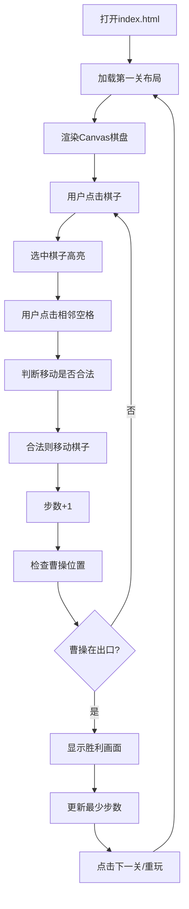

## 1. 产品概述
华容道是一款经典的中国传统益智滑块游戏，玩家需要通过移动各个棋子，帮助曹操（2×2大块）从棋盘底部中央的出口逃脱。本项目使用纯原生JavaScript + Canvas实现，无需后端支持，打开index.html即可游玩。

- 主要目的：提供一个可在浏览器中运行的经典华容道游戏，支持多个关卡、计步、撤销等功能
- 目标用户：益智游戏爱好者，对传统中国游戏感兴趣的玩家
- 产品价值：在浏览器中即可体验经典华容道游戏，无需安装任何应用

## 2. 核心功能

### 2.1 用户角色
| 角色 | 注册方式 | 核心权限 |
|------|----------|----------|
| 普通玩家 | 无需注册 | 游玩所有关卡、记录步数、撤销操作 |

### 2.2 功能模块
1. **游戏主界面**：Canvas棋盘渲染、棋子显示、操作交互
2. **关卡系统**：5个内置经典关卡、关卡切换
3. **游戏控制**：棋子移动、撤销操作、重置关卡、下一关
4. **数据记录**：计步器、历史最少步数（localStorage存储）
5. **胜利判定**：曹操到达出口位置时触发胜利

### 2.3 页面详情
| 页面名称 | 模块名称 | 功能描述 |
|----------|----------|----------|
| 游戏主页面 | 棋盘渲染 | 4列5行棋盘，使用Canvas绘制不同类型棋子 |
| 游戏主页面 | 交互控制 | 点击棋子选中，再点击相邻空格移动 |
| 游戏主页面 | 状态显示 | 当前关卡、步数、历史最少步数 |
| 游戏主页面 | 操作按钮 | 撤销、重置、下一关 |
| 游戏主页面 | 胜利提示 | 曹操到达出口时显示胜利信息 |

## 3. 核心流程

用户打开页面 → 加载第一关 → 显示棋盘和初始布局 → 用户点击棋子选中 → 用户点击相邻空格 → 棋子移动 → 步数+1 → 检查曹操是否到达出口 → 若到达则显示胜利 → 可选择下一关或重玩

## 4. 用户界面设计

### 4.1 设计风格
- 主色调：中国传统红木色（#8B4513）作为棋盘底色，金色（#FFD700）作为曹操棋子颜色
- 辅助色：深棕色（#654321）边框，米白色（#F5F5DC）背景
- 按钮风格：圆角木质按钮，带有轻微3D阴影效果
- 字体：使用Noto Serif SC（思源宋体）体现古典风格
- 布局：居中布局，棋盘在中央，控制按钮在底部，状态信息在顶部

### 4.2 页面设计概述
| 页面名称 | 模块名称 | UI元素 |
|----------|----------|--------|
| 游戏主页面 | 顶部状态栏 | 关卡编号、当前步数、历史最少步数 |
| 游戏主页面 | 中央棋盘 | Canvas绘制的4×5棋盘，不同颜色区分棋子类型 |
| 游戏主页面 | 底部控制区 | 撤销按钮、重置按钮、下一关按钮 |
| 游戏主页面 | 胜利弹窗 | 半透明遮罩 + 居中胜利提示 + 操作按钮 |

### 4.3 响应式
- 桌面端优先设计
- 棋盘使用固定尺寸，居中显示
- 适配不同屏幕尺寸，确保棋盘完整显示

### 4.4 棋子样式
- 曹操（2×2）：金色背景，红色"曹"字，圆角
- 横将（1×2）：深红色背景，白色"将"字
- 竖将（2×1）：深棕色背景，白色"兵"字（竖排）
- 小兵（1×1）：浅棕色背景，深棕色"卒"字
- 出口位置：棋盘底部中央有明显标记
