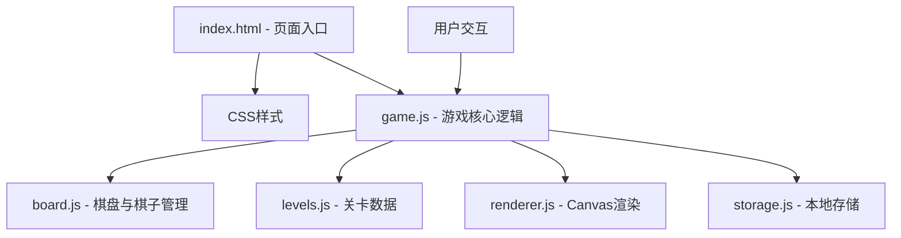

## 1. 架构设计



## 2. 技术描述
- 前端：纯原生HTML5 + CSS3 + JavaScript (ES6+)
- 渲染：HTML5 Canvas 2D API
- 数据存储：localStorage（浏览器本地存储）
- 无后端、无外部库、无构建工具

## 3. 文件结构
| 文件 | 职责 |
|------|------|
| index.html | 页面结构，引入CSS和JS |
| css/style.css | 页面样式、按钮样式、布局 |
| js/levels.js | 5个经典关卡的硬编码布局数据 |
| js/board.js | 棋盘状态管理、移动逻辑、胜利判定 |
| js/renderer.js | Canvas绘制函数、棋子渲染 |
| js/storage.js | localStorage读写、最少步数管理 |
| js/game.js | 主游戏循环、事件处理、撤销/重置逻辑 |

## 4. 数据模型

### 4.1 棋子类型定义
```javascript
const PIECE_TYPES = {
    CAOCAO: 'caocao',    // 2×2 曹操
    HENG: 'heng',        // 1×2 横将
    SHU: 'shu',          // 2×1 竖将
    XIAOBING: 'xiaobing' // 1×1 小兵
};
```

### 4.2 关卡数据结构
```javascript
// 每个关卡包含棋子数组，每个棋子定义类型、位置
const LEVELS = [
    {
        name: "横刀立马",
        pieces: [
            { type: 'caocao', x: 1, y: 0 },
            { type: 'heng', x: 0, y: 0 },
            { type: 'heng', x: 2, y: 0 },
            // ...
        ]
    }
];
```

### 4.3 棋盘状态
- 棋盘：4列 × 5行的二维数组，记录每个格子被哪个棋子占据
- 棋子列表：每个棋子包含类型、x、y坐标
- 历史记录：最多10步的状态栈，用于撤销

### 4.4 本地存储键
- `huarongdao_best_level_{n}`：第n关的最少步数

## 5. 核心算法

### 5.1 移动合法性判断
1. 检查目标位置是否在棋盘范围内
2. 检查棋子移动方向上的所有格子是否为空
3. 曹操移动需要检查2×2范围

### 5.2 胜利判定
检查曹操的左上角坐标是否为 (x=1, y=3)，即第4行第2列（0索引）

### 5.3 坐标转换
使用 `canvas.getBoundingClientRect()` 将点击坐标转换为棋盘格子坐标

## 6. 交互流程
1. 点击棋子：遍历所有棋子，判断点击坐标落在哪个棋子范围内
2. 高亮选中：重绘时高亮选中的棋子边框
3. 点击空格：判断是否与选中棋子相邻且移动合法
4. 执行移动：更新棋子位置，步数+1，记录历史
5. 撤销操作：从历史栈弹出上一步状态，恢复棋盘
